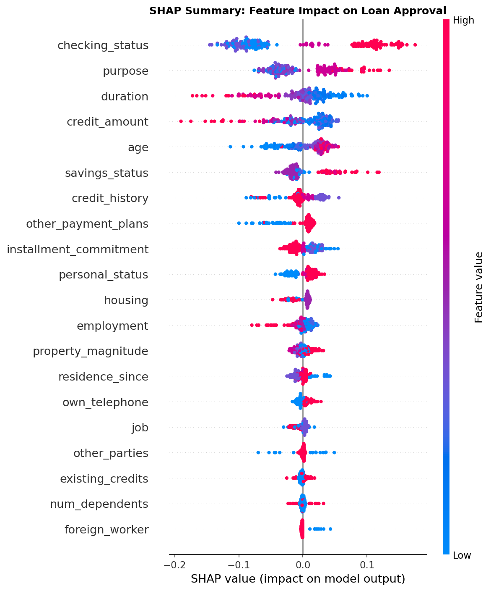

# Explainable Loan Approval Predictor

## Problem

Lenders need to explain why a loan was approved or denied. Regulations like the EU AI Act and the US Equal Credit Opportunity Act require that automated credit decisions be interpretable, not just accurate.

## Solution

This project trains a Random Forest classifier on the German Credit dataset (1000 real loan applicants, 20 features) to predict whether a loan application should be approved or denied. It then uses SHAP to generate a per-decision explanation showing exactly which factors drove the outcome and by how much. The result is packaged into an interactive Streamlit dashboard where a user can enter applicant details and immediately receive a prediction with a visual SHAP waterfall chart explaining the decision. This is the kind of tool a bank, fintech, or insurance company would actually deploy.

## Tools Used

- Python 3.10
- pandas, numpy (data cleaning and manipulation)
- scikit-learn (Random Forest classifier, preprocessing, evaluation)
- SHAP (SHapley Additive exPlanations for model interpretability)
- Streamlit (interactive web dashboard)
- matplotlib, seaborn (visualization)
- Jupyter Notebook (analysis and storytelling)
- OpenML (dataset source, no login required)

## How to Run It

**Step 1. Clone the repository and navigate to the project folder.**

```bash
git clone <your-repo-url>
cd "Project 1_Explainable Loan Approval Predictor"
```

**Step 2. Create and activate a virtual environment.**

```bash
python -m venv venv
```

On Windows:
```bash
.\venv\Scripts\Activate.ps1
```

On Mac or Linux:
```bash
source venv/bin/activate
```

You will see `(venv)` appear at the start of your terminal prompt, which confirms the environment is active.

**Step 3. Install dependencies.**

```bash
pip install -r requirements.txt
```

**Step 4. Run the pipeline to train the model and generate all output files.**

```bash
python pipeline.py
```

This downloads the dataset from OpenML, trains the model, evaluates it, and saves all model files and plots to the `data/` folder. You will see accuracy and ROC-AUC scores printed in the terminal. This step must be completed before launching the dashboard.

**Step 5. Launch the Streamlit dashboard.**

```bash
streamlit run app/streamlit_app.py
```

Open the URL shown in the terminal (usually `http://localhost:8501`). Fill in the applicant form on the left sidebar and click Predict Approval.

**Step 6. (Optional) Open the Jupyter notebook for the full analysis.**

```bash
jupyter notebook notebooks/loan_approval_analysis.ipynb
```

Run all cells from top to bottom. Each section is explained with markdown commentary. This notebook covers the same logic as `pipeline.py` but with step-by-step explanations intended for learning and presentation.

## Order of Execution

This table shows the correct order to run each file and what each one does.

| Order | File | Purpose | Output |
|-------|------|---------|--------|
| 1 | `requirements.txt` | Install all dependencies | Packages installed in your environment |
| 2 | `pipeline.py` | Download data, train model, evaluate, generate SHAP plots | `data/model.pkl`, `data/label_encoders.pkl`, `data/feature_columns.pkl`, `data/german_credit.csv`, `data/shap_summary.png`, `data/shap_waterfall.png` |
| 3 | `app/streamlit_app.py` | Load the saved model and serve the interactive dashboard | Live web app at `http://localhost:8501` |
| Optional | `notebooks/loan_approval_analysis.ipynb` | Walk through the full analysis with explanations | Same plots and model as `pipeline.py`, presented step by step |

`pipeline.py` must always run before `streamlit_app.py` because the dashboard loads the model files that the pipeline produces. The notebook is independent and self-contained — it trains its own copy of the model when you run it.

## Project Structure

```
Project 1_Explainable Loan Approval Predictor/
├── data/                              Generated by pipeline.py (do not edit manually)
│   ├── model.pkl                      Trained Random Forest model
│   ├── label_encoders.pkl             Fitted encoders for categorical features
│   ├── feature_columns.pkl            Ordered list of feature names
│   ├── german_credit.csv              Raw dataset from OpenML
│   ├── shap_summary.png               Global feature importance plot
│   ├── shap_waterfall.png             Local explanation for one sample
│   └── confusion_matrix.png           Model evaluation chart
├── notebooks/
│   └── loan_approval_analysis.ipynb   Full analysis with commentary (for learning)
├── app/
│   └── streamlit_app.py               Interactive prediction dashboard
├── pipeline.py                        Clean end-to-end ML script (run this first)
├── requirements.txt                   All dependencies
└── README.md
```

## Screenshot



The SHAP summary plot above shows global feature importance. Each dot is one applicant. Red means a high feature value. The x-axis position shows how much that feature pushed the model toward approval or denial.

## What I Learned

Working through this project taught me that a model's accuracy score is the least interesting part of the work. The real challenge is building trust: making the model's reasoning visible, verifiable, and defensible to a non-technical stakeholder. SHAP made this concrete by letting me show, for any single applicant, exactly which features pushed the prediction in each direction and by how much. I also learned why `checking_status` and `credit_history` dominate credit decisions in this dataset, which matches what human underwriters would tell you intuitively.
